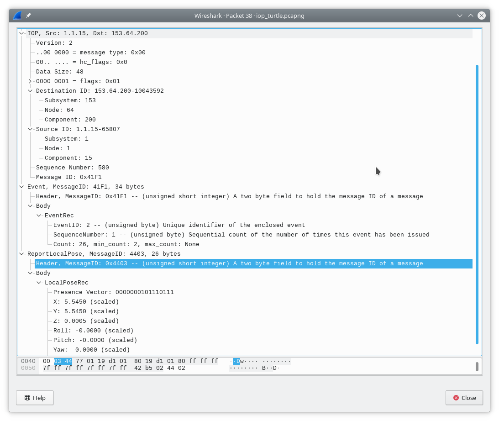

# IOP Wireshark Plugin

## Summary

The **IOP [Wireshark][wireshark] Plugin** allows deeps inspection into [IOP][iop] messages. This is done by auto-generated [LUA][lua] script from JSIDL files. JSIDL stands for JAUS Service Interface Definition Language and contains also message definitions used to generate wireshark dissectors.

This package contains no JSIDL files. You can find such files in [JausToolsSet][jts] or [ROS/IOP Bridge][ros_iop_bridge]. Without JSIDL files only the IOP header will be parsed.



## Install wireshark plugin

We use [PyXB][pyxb] to generate python code for XMLSchema of JSIDL. Install dependencies:
```console
sudo apt install python3-pyxb -y
```

For using as ROS package you need additionally
```console
sudo apt install python3-catkin-pkg -y
```
**Note**: for use with python2 replace python3 with python.

**Note**: for use in Ubuntu 20.04 with python3 install with pip:
```
python3 -m pip install -U pyxb
export PATH=$PATH:~/.local/bin/
```

Clone this repository to your preffered destination.

```console
git clone https://github.com/fkie/iop_wireshark_plugin
```

### As ROS package inside ROS environment

If you use it with ROS put this repository into ROS workspace and call  

  ```console
  roscd && catkin build
  ```

### As standalone package

Use setup.py to install the code:

  ```console
  cd iop_wireshark_plugin/fkie_iop_wireshark_plugin
  python3 setup.py install --user --record installed_files.txt
  ```

  The executable **iop_create_dissector.py** is now located in `~/.local/bin`.

  **Note:** to remove installed files call

  ```console
  xargs rm -rf < installed_files.txt
  ```

## Generate wireshark plugin

Run **iop_create_dissector.py** to generate the Lua script.

In ROS environment you can do it by

```console
rosrun fkie_iop_node_manager iop_create_dissector.py
```

otherwise

```console
python3 ~/.local/bin/iop_create_dissector.py
```

If no path for JSIDL files is given the script tries to find the `fkie_iop_builder` ROS package from [ROS/IOP Bridge][ros_iop_bridge]. If path not found only dissector for IOP header will be generated. You can change this path with `--input_path`.

By default, the plugin is written to the file `~/.local/lib/wireshark/plugins/fkie_iop.lua`. You can change it by `--output_path`.

You can exclude subfolder from parsing if they contain different versions of the same message, e.g.

```console
rosrun fkie_iop_wireshark_plugin iop_create_dissector.py --exclude urn.jaus.jss.core-v1.0
```

## Usage

Type `iop` into filter line in wireshark to display only IOP messages.

You can also filter for specific messages by ID or name, e.g.

`iop.message_name == "QueryIdentification"`

See **Wireshark - Display Filter Expression** window for other filter options.


[wireshark]: https://www.wireshark.org
[iop]: https://en.wikipedia.org/wiki/UGV_Interoperability_Profile
[lua]: https://www.lua.org
[jts]: https://github.com/jaustoolset/jaustoolset
[ros_iop_bridge]: https://github.com/fkie/iop_core
[pyxb]: https://pypi.org/project/PyXB
